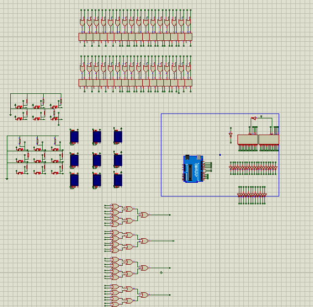
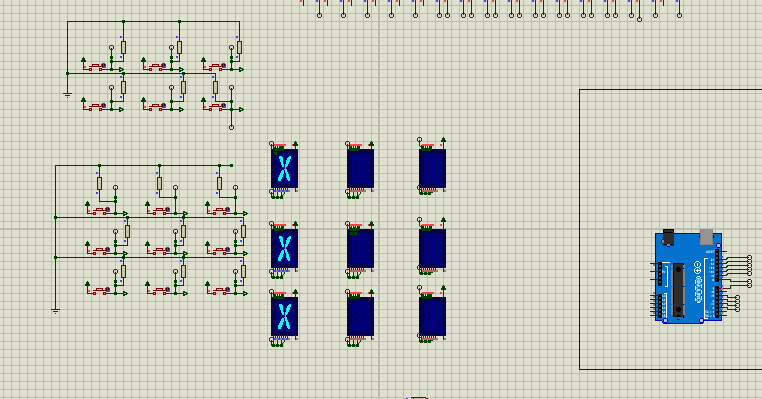
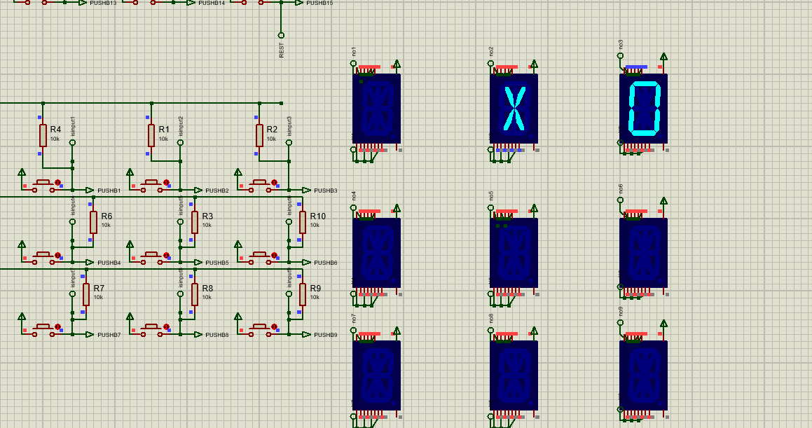
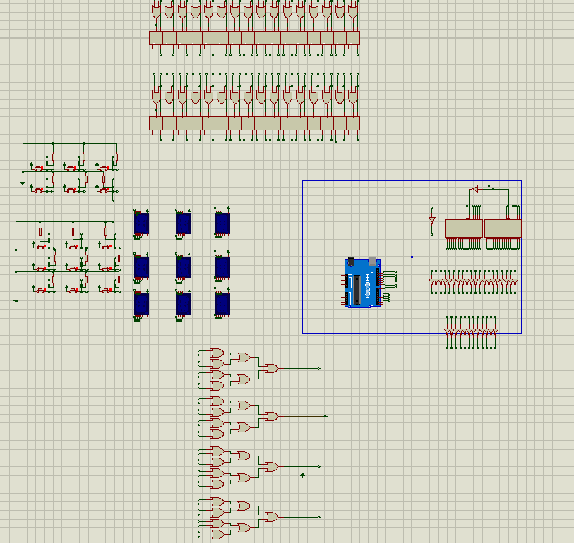

# Embedded Arcade System | C++ & Bare-Metal Hardware Architecture

  
  
  
  

An embedded, multi-game hardware console engineered using C++ and an Arduino microcontroller. This project features a custom Hardware Abstraction Layer (HAL) designed to manage a 4-bit multiplexed input/output system, interfacing directly with external flip-flops and a 5-to-32 decoder to control a dynamic LED display grid.

The system runs two distinct logic loops: a dynamic Memory Sequence game featuring binary score encoding, and a Tic-Tac-Toe engine powered by a custom heuristic AI decision tree.

## 🧠 System Architecture & C++ Implementation

### 1. Hardware Abstraction Layer (HAL) & Multiplexed I/O
To overcome the limited GPIO pins on the microcontroller, the display system utilizes a 4-bit data bus (`A, B, C, D`) combined with manual clock pulsing (`clkexute()`) to latch data into external hardware flip-flops. 
* **Bitwise Encoding:** Game state coordinates are converted into 4-bit binary signals using bitwise AND masking (`number & 1`, `number & 2`, etc.) before being pushed to the hardware decoder.
* **Clock Synchronization:** Precise `delay()` timings (10ms pulses) are manually coded to respect the setup and hold times of the physical logic gates.

### 2. Algorithmic AI Opponent (Tic-Tac-Toe)
The single-player mode features a stateless, heuristic-based AI opponent that evaluates the board in real-time without relying on heavy recursion, keeping memory overhead near zero.
* **Decision Tree Priority:** `Win in one move` → `Block opponent win` → `Take Center` → `Take Corner` → `Random fallback`.
* **State Simulation:** The AI dynamically simulates future board states (`XOMAP[i] = player; checkGameState();`) to identify critical threat vectors before executing a move.

### 3. State Machines & Dynamic Memory Game
The system features a secondary logic loop for a sequence-based Memory Game.
* **Algorithmic Generation:** Sequences are procedurally generated utilizing modular arithmetic against the microcontroller's `millis()` uptime counter to ensure varied gameplay without external entropy sources.
* **Binary Score Encoding:** Upon failure, the player's final score is converted from a decimal integer into a physical binary display across the hardware LEDs using bitwise shifting (`score & (1 << bit)`).

### 4. Input Processing & Debouncing
Physical arcade buttons are prone to electrical noise ("bouncing"). The software implements a custom input processing pipeline to guarantee clean signal reading:
* Hardware pull-up resistors paired with a custom while-loop debounce algorithm ensure the system traps execution until the physical button is completely released, preventing double-triggering during sensitive logic cycles.

---

## 🎮 Hardware Control Interface

The console is controlled via a multiplexed input matrix. Below is the hardware command mapping:

| Input | Action | Description |
| :--- | :--- | :--- |
| **Buttons 1-9** | Play / Select | Maps directly to the 3x3 game grid. |
| **Button 12** | Memory Game | Initializes the dynamic sequence memory logic. |
| **Button 13** | Toggle AI Mode | Switches between PvP and Single-Player (AI) mode. |
| **Button 14** | Diagnostic Animation | Triggers the system diagnostic / custom display sequence. |
| **Button 15** | System Reset | Triggers `fullReset()`, clearing the board and hardware flip-flops. |

## 🚀 Installation & Deployment

This project interacts directly with a custom physical circuit board. To run the logic on a compatible microcontroller setup:

1. Flash the provided `Arduino XOGAME.ino.hex` file directly to the microcontroller.
2. Ensure the 4-bit input buttons and the 5-to-32 display decoder are wired to the corresponding digital pins defined in the `OUTPUT PINS` and `INPUT PINS` configuration headers.
